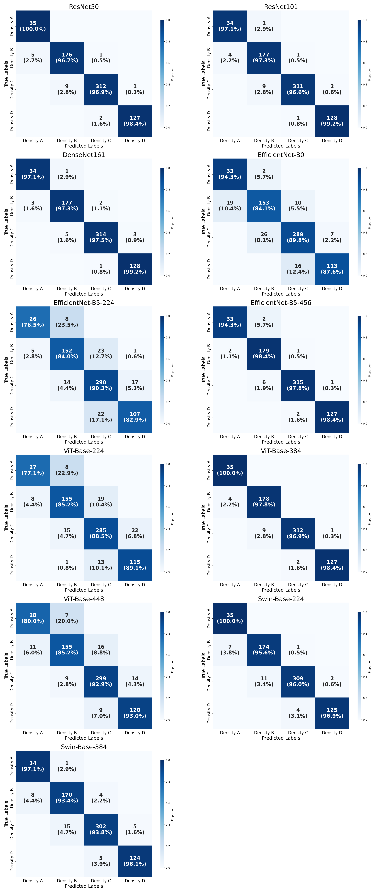

### MVMammo-Density Public

### Authors
Nak-Jun Sung, Donghyun Lee, Eun-Gyeong Lee, Bo Hwa Choi, Chae Jung Park
National Cancer Center Korea

### Description
- This repository provides code for training and inference of deep learning-based models that classify four breast tissue density categories (BI-RADS: A, B, C, D) from mammography images.  
It is built on PyTorch and the timm library, and includes a custom classification head that supports a variety of image classification backbones (such as efficientnet, resnet, swin, vit, etc.).

- Main features:
    - Easy selection and extensibility of diverse backbones (supports timm and torchvision)
    - Sampling options to mitigate class imbalance in the dataset
    - Automatic application of standard image preprocessing (augmentation and normalization)
    - Automatic train/validation split, and per-class weight calculation
    - Provides a custom loss function based on CrossEntropy (DistanceWeightedCrossEntropyLoss), and major evaluation metrics (accuracy, sensitivity, specificity, F1, ROC-AUC, etc.)
    - Automatic saving of best/last checkpoints and logging of major metrics during training

- Code structure:
    - model.py: Defines datasets (Dataset) and deep learning models, supporting various backbones

- Pretrained weight download link:
| Model Name   | Download Link |
| ------------ | ------------- |
| DenseNet-161 | [Link](https://drive.google.com/file/d/1NhkkU76NkB3iShRykMp6EY6OWgBsUadw/view?usp=sharing) |
| ResNet-50 | [Link](https://drive.google.com/file/d/1S_MZDRV_zsgM21xmEkyt4PoMzxIbiLH2/view?usp=sharing)|
| ResNet-101 | [Link](https://drive.google.com/file/d/1kE5KjxOmIMlkZ2MAN8p5d5LRG3dz9KmB/view?usp=sharing)|
| EfficientNet-B0 | [Link](https://drive.google.com/file/d/14NsDWgWszTZyBxCPz9lApqI2Sv6CsutH/view?usp=sharing)|
| EfficientNet-B5-224 |[Link](https://drive.google.com/file/d/1wUmgpGrbRr349A1mY7dx4q09kB36yXP8/view?usp=sharing) |
| EfficientNet-B5-456 |[Link](https://drive.google.com/file/d/1JMzyhSW_NKJfHpzpi6D5p9RU8kFatRA1/view?usp=sharing) |
| ViT-Base-224 |[Link](https://drive.google.com/file/d/10I2v1A_hWqJYWD5G9UQsG24klAuS4jLP/view?usp=sharing) |
| ViT-Base-384 | [Link](https://drive.google.com/file/d/1t5Y-pOqL1LT9WRl8oqMu6-y4vhwFO0k1/view?usp=sharing)|
| ViT-Base-448 | [Link](https://drive.google.com/file/d/1VEhwMKS4jBux_481gv8rnYA1xrA8-RK6/view?usp=sharing)|
| Swin-Base-224 | [Link](https://drive.google.com/file/d/1vNkFhW8OjoY9JLrmL0EpY7bmsqVcZUvr/view?usp=sharing)|
| Swin-Base-384 | [Link](https://drive.google.com/file/d/1dpuvNq0-r7SkxZ6RaLv2fuS6XD28xA5I/view?usp=sharing)|

### Evaluation Results
The following is an example confusion matrix from our internal results:
